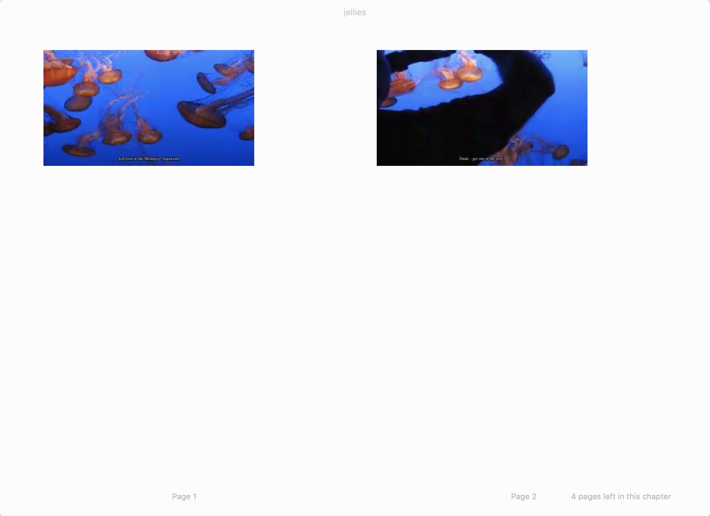

# Video to epub

Have you ever wanted to `read` a film? If so then this is the project for you!

This project works by scanning the video to find frames with subtitles, it then
pads out the list of frames if the gaps between them is greater than 5 seconds
and finally extracts the frames and assembles them into an epub.

## Example:

Turn this:

[](resources/jellies.mp4)

Into this:

[](resources/jellies.epub)

Exciting eh????

## Usage

If you have a video with subtitles:

```bash
$ ./video-to-epub video.mp4
```

Will ouput an epub file with the same name!

If you have separate video and subtitles files:

```bash
$ ./video-to-epub video.mp4 subs.srt
```

Tada!

## Why?

Idk, why not?
